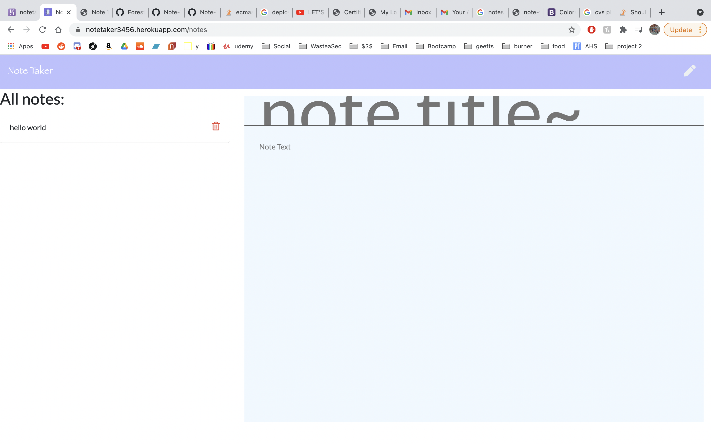
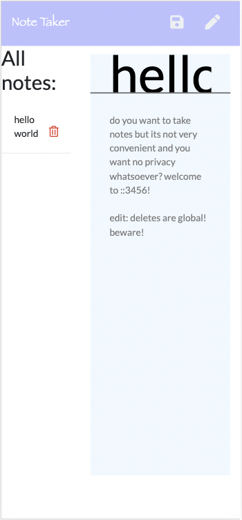

# Forest Wilson - Homework 11 - Note Taker
MIT - (https://opensource.org/licenses/MIT) - For Good.
<!-- Original deployment date: June 7th, 2021 -->

## Table of Contents:
- [This week's concepts](#this-weeks-concepts)
- [Tech used](#tech-used)
- [Project description](#project-description)
- [Project installation](#project-installation)
- [Additional comments](#additional-comments)
- [Contribution information](#contribution-information)
- [Questions](#questions-or-concerns)
- [Pictures, Links](#extras)

### About This Project

* # This weeks concepts:
  1. Heroku deployemnet
  2. Express.js

* # Tech used:
  1. HTML
  2. CSS
  3. JavaScript
  4. Node.js
  5. Npm
  * - Express.js
    - Compression.js

* # Project description:
  Given a need to have as many places to take notes as possible, I created and deployed an application on Heroku that allows users to manage their notes and interact with them using CRUD-like functionality (Create, read, update and delete).

* # Project installation
  * from repo
    1. npm i
    2. npm start
    3. Take some notes.

  * from heroku
    1. Go to link
    2. Enjoy
 

* # Additional comments
(Jun/07/21)

  - found a lot of fun solutions to my problems in this project. having front end build already was nice, but of course couldnt help modifying some things. 

  - I did notice there wasnt a feature to modify notes so I thought it would be interesting to try and get that functionallity, since this is an app I could really use.

  - Big title. Big title.

#### Contribution information 

- If you would like to contribute to this project, please follow best practices and message me at one of the provided contacts bellow if you want to push!

###### Questions or concerns? 
* Please contact me at one of the following!
  Email - hexaforest@gmail.com
  gitHub - https://github.com/ForestW70/

# Extras

* Screenshots:
  - 
  - 
  - 

* Links:
  - [Repo page](https://github.com/ForestW70/hw11notetaker)
  - [Live site](https://notetaker3456.herokuapp.com/notes)