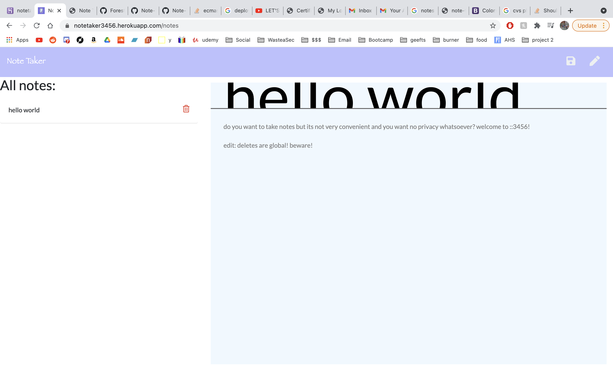

# Forest Wilson - Homework 11 - Note Taker
MIT - (https://opensource.org/licenses/MIT) - For Good.
<!-- Original deployment date: June 7th, 2021 -->

## Table of Contents:
- [Tech used](#tech-used)
- [Project description](#project-description)
- [Usage instructions](#usage-instructions)
- [Project installation](#project-installation)
- [Additional comments](#additional-comments)
- [Contribution information](#contribution-information)
- [Questions](#questions-or-concerns)
- [Extras](#extras)

### About This Project

* # Tech used:
  1. HTML
  2. CSS
  3. JavaScript
  4. Node.js
  5. Npm
  - express.js
  - compression.js

* # Project description:
  Welcome to notetaker3456, where you can save, modify, and delete notes to your page so you can keep track of all those important things in life like 10 grocery lists youve made but didnt end up needing afterall.

* # Usage instructions
  Write your note, save, then click create new note if you've got a lot to say. Otherwise click back onto your saved note and keep adding or removing anything you want from it. once your done with the note and want to remove clutter, just press delete. remember, there is no log-in process, so dont be posting any secrets you dont want anyone to see! or do, that would be far more interesting.
  

* # Project installation
  * from repo
    1. npm i
    2. npm start
    3. Take some notes.
  * from heroku
    1. Go to link
    2. Enjoy
 

* # Additional comments
  - found a lot of fun solutions to my problems in this project. having front end build already was nice, but of course couldnt help modifying some things. 

  - I did notice there wasnt a feature to modify notes so I thought it would be interesting to try and get that functionallity, since this is an app i could really use.

  - Fincally got my debug working for node as well. hip-hip-hooray.

  - Big title. Big title.

#### Contribution information 

- If you would like to contribute to this project, please follow best practices and message me at one of the provided contacts bellow if you want to push!

###### Questions or concerns? 
* Please contact me at one of the following!
  Email - hexaforest@gmail.com
  gitHub - https://github.com/ForestW70/

# Extras

* Screenshots:
  - 
  - 
  - 

* Links:
  - [Repo page](https://github.com/ForestW70/hw11notetaker)
  - [Live site](https://notetaker3456.herokuapp.com/notes)